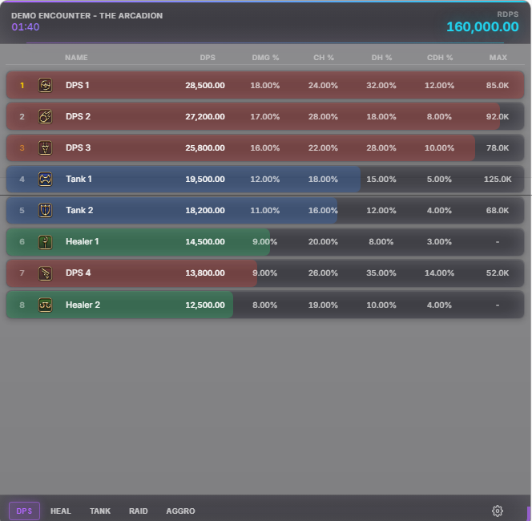
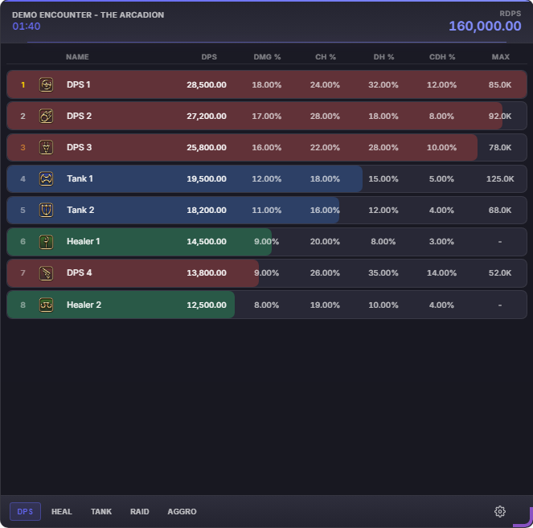
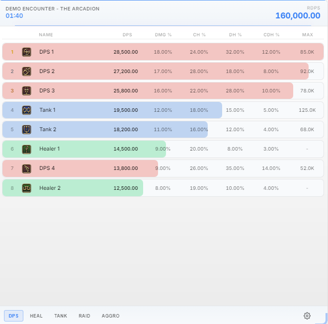
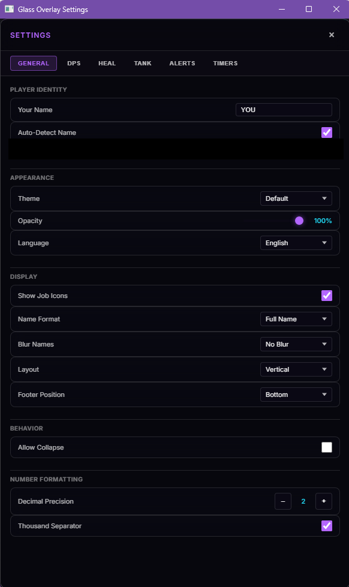
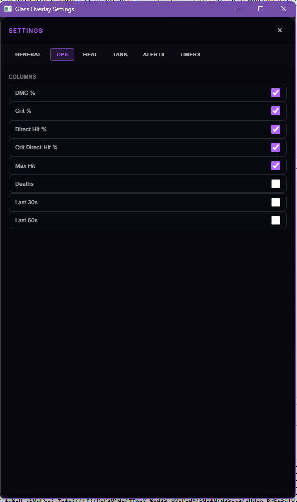
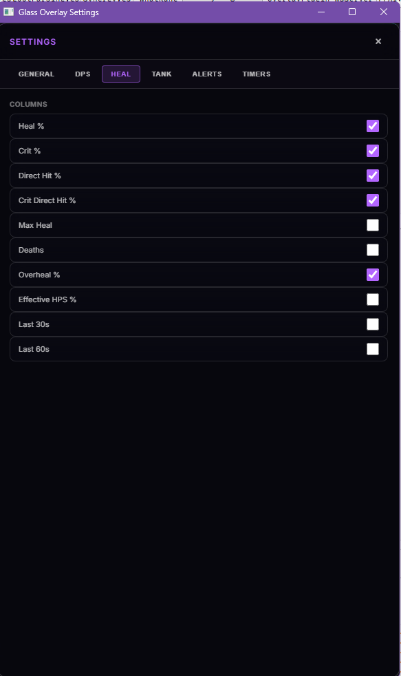
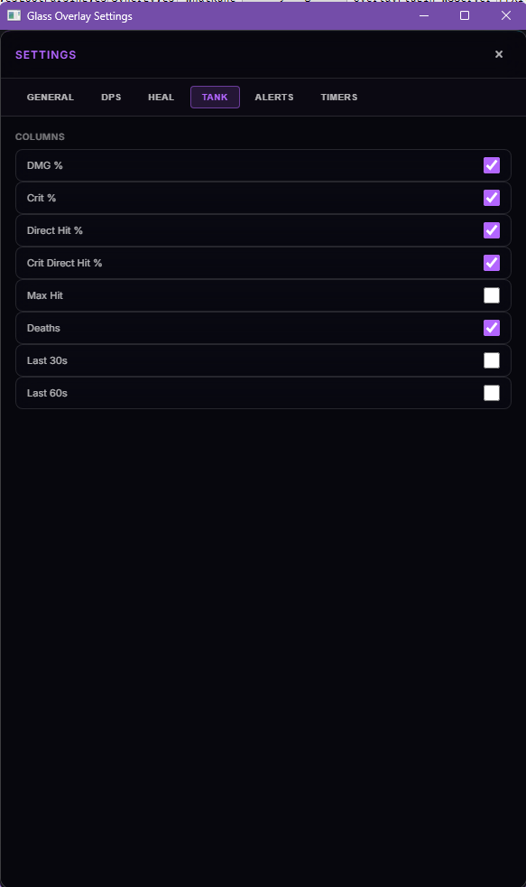
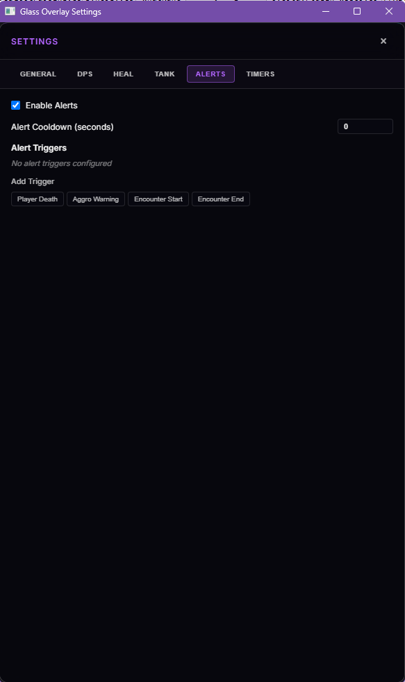
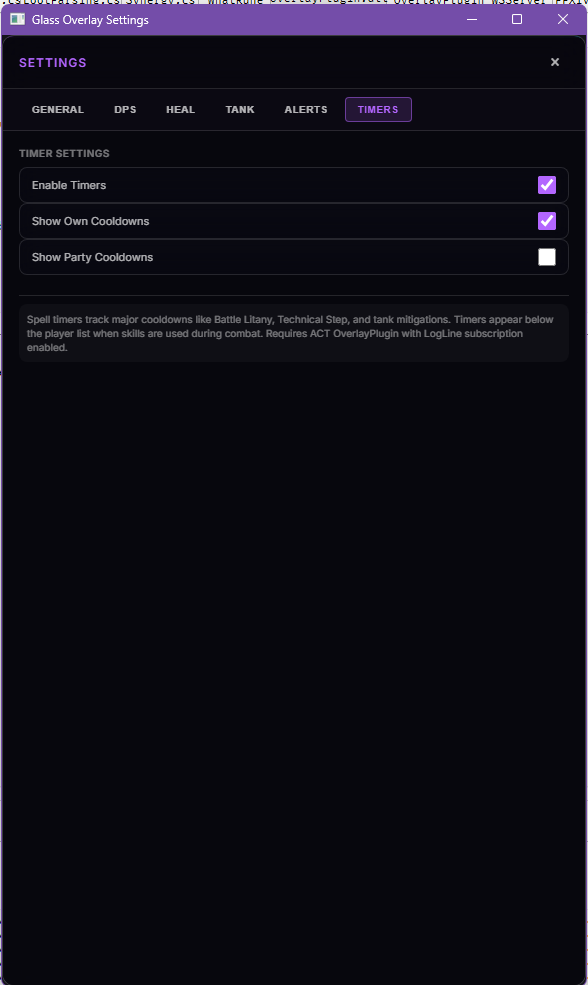

# FFXIV Glass Overlay

A sleek, modern DPS overlay for Final Fantasy XIV inspired by Apple's Liquid Glass (inspired, not replicating). Built for use with [OverlayPlugin](https://github.com/OverlayPlugin/OverlayPlugin) and Advanced Combat Tracker (ACT).

## Preview



### Themes

| Default | Dark | Light |
|---------|------|-------|
|  |  |  |

> **Performance Note:** The Default theme uses CSS `backdrop-filter` with heavy blur effects which can be GPU-intensive on some systems. If you experience performance issues, consider using the **Dark** or **Light** themes which disable these effects.

## Features

- **Clean UI** - Modern translucent design with multiple theme options (Default, Dark, Light)
- **Role-based Views** - Switch between DPS, Healing, Tank, Raid, and Aggro views
- **Job Icons** - Display job icons for easy player identification
- **Customizable Display**
  - Adjustable max players shown (4-24)
  - Name formatting options (full name, first name, last name, initials)
  - Configurable stat columns per view (DPS, Heal, Tank)
  - Toggle job icons on/off
  - Highlight your own character
  - Privacy blur mode for streaming
- **TTS Alerts** - Text-to-speech notifications for combat events (death alerts, DPS thresholds, aggro warnings)
- **Spell Timers** - Track party cooldowns and raid buffs with visual timers
- **Localization** - Available in English, Japanese, German, and French
- **Real-time Stats** - DPS, HPS, damage taken with percentage breakdowns
- **Responsive Design** - Resizable overlay that fits in any corner of your screen
- **Persistent Settings** - Your preferences are saved locally

## Installation

### Prerequisites

1. [Advanced Combat Tracker (ACT)](https://advancedcombattracker.com/)
2. [OverlayPlugin](https://github.com/OverlayPlugin/OverlayPlugin) - Follow the installation instructions on their repository

### Adding the Overlay

1. In ACT, go to **Plugins** → **OverlayPlugin.dll**
2. Click **New** to create a new overlay
3. Select **Mini Parse** as the preset
4. Set the overlay URL to the hosted version or your local build path
5. Adjust the overlay size and position to your preference
6. Enable **Click-through** if you want the overlay to not interfere with gameplay

### Local Installation

If you want to run the overlay locally:

1. [Fork this repository](https://github.com/PiousVenom/ffxiv-glass-overlay/fork)
2. Clone your fork:

```bash
git clone https://github.com/YOUR_USERNAME/ffxiv-glass-overlay.git
cd ffxiv-glass-overlay

# Install dependencies
npm install

# Build for production
npm run build
```

Then point your OverlayPlugin to the `build/index.html` file.

## Development

```bash
# Start development server
npm run dev

# Build for production
npm run build

# Preview production build
npm run preview

# Type check
npm run typecheck
```

## Tech Stack

- **React 19** - UI framework
- **TypeScript** - Type safety
- **Vite** - Build tool
- **CSS3** - Modern styling with backdrop-filter effects

## Configuration

Click the gear icon (⚙️) in the footer to access settings. Settings open in a separate window for easy configuration.

### General Settings



| Setting        | Description                                   |
|----------------|-----------------------------------------------|
| Your Name      | Your character name (displays as "YOU")       |
| Auto-detect    | Automatically detect player name from game    |
| Language       | UI language (English, Japanese, German, French) |
| Theme          | Visual theme (Default, Dark, Light)           |
| Opacity        | Overlay transparency level                    |

### View Settings

Configure which stat columns appear in each view:

| DPS View | Heal View | Tank View |
|----------|-----------|-----------|
|  |  |  |

### Alerts

Configure TTS alerts for combat events:



| Alert Type      | Description                                   |
|-----------------|-----------------------------------------------|
| Death Alert     | Announce when players die                     |
| DPS Threshold   | Alert when your DPS drops below a threshold   |
| Aggro Warning   | Warning when you gain aggro unexpectedly      |

### Timers

Track party cooldowns and raid buffs:



## Keyboard Navigation

The settings dropdown supports full keyboard navigation:
- **Arrow Up/Down** - Navigate options
- **Enter/Space** - Select option
- **Escape** - Close dropdown

## License

This project is open source and available under the [GNU General Public License v3.0](LICENSE).

## Acknowledgments

- [OverlayPlugin](https://github.com/OverlayPlugin/OverlayPlugin) - ACT plugin that makes web overlays possible
- Apple for Liquid Glass
- The FFXIV community for feedback and support
